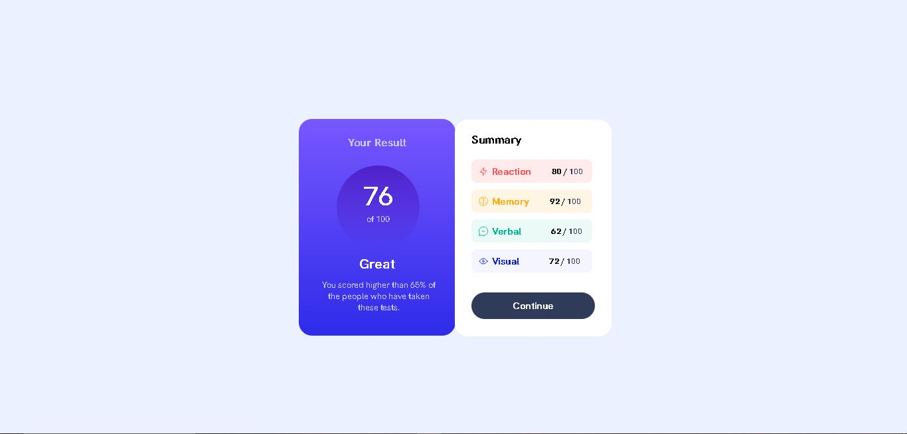
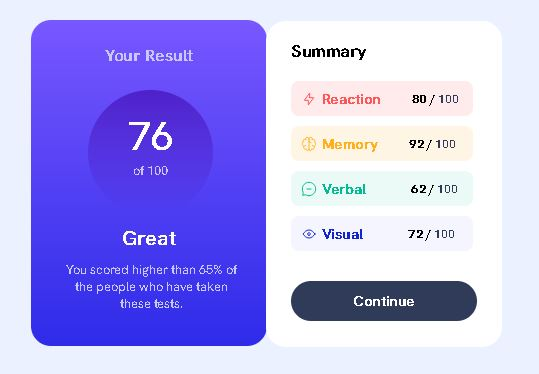
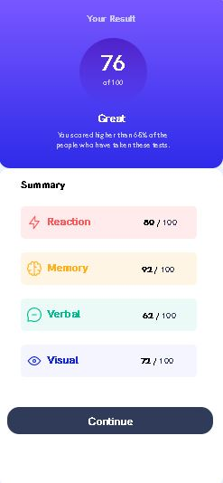

# Componente de resumo de resultados 
Meu primeiro projeto sozinho, do começo ao fim, em HTML e CSS. 😁

## Versão Desktop:

[]

[]

## Versão Celular:

[]

## Tecnologias utilizadas
- HTML
- CSS

